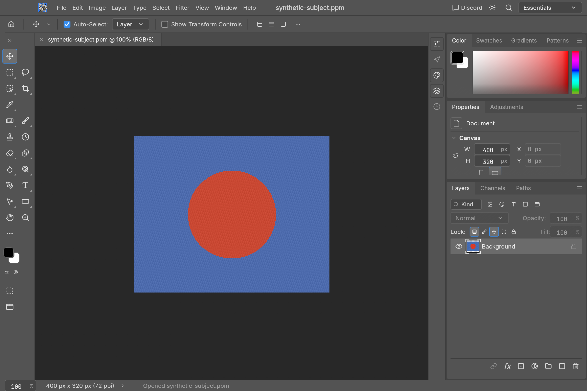
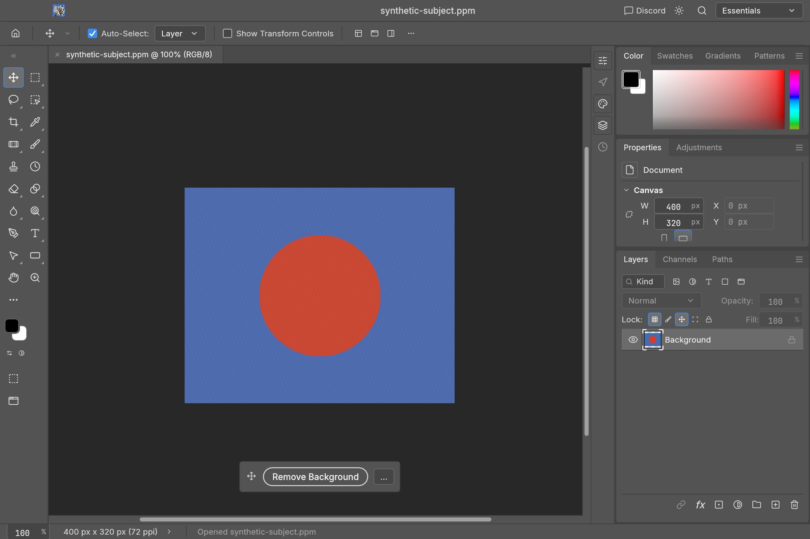
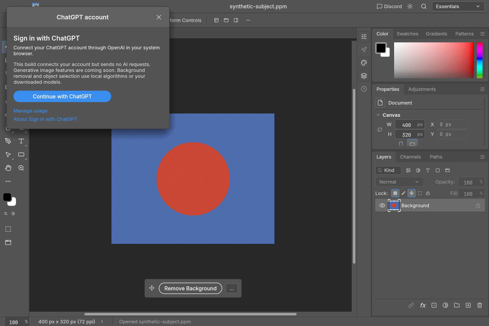
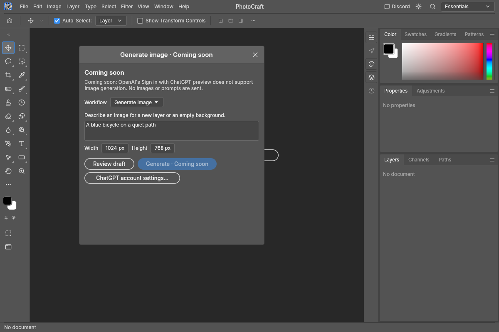
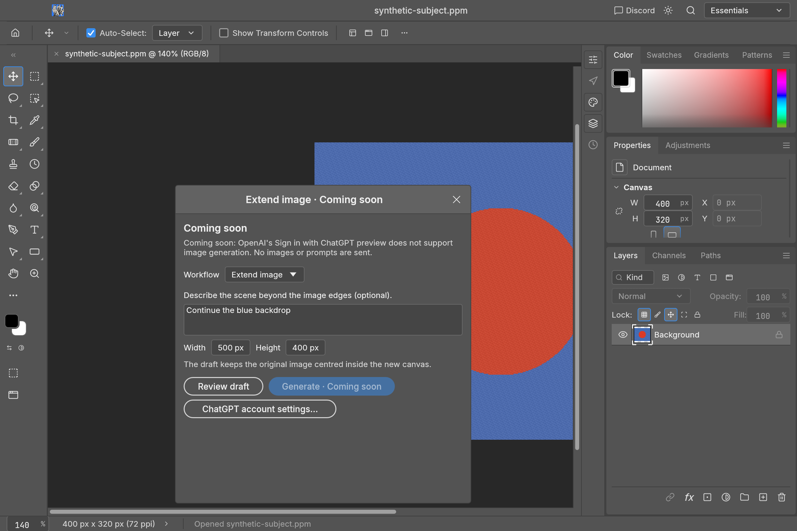
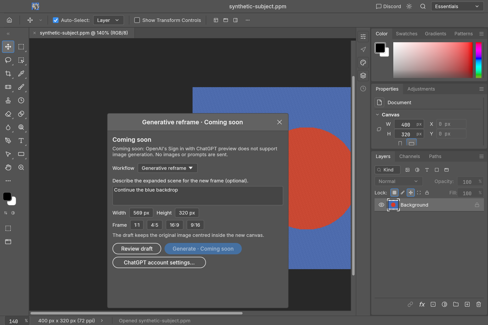
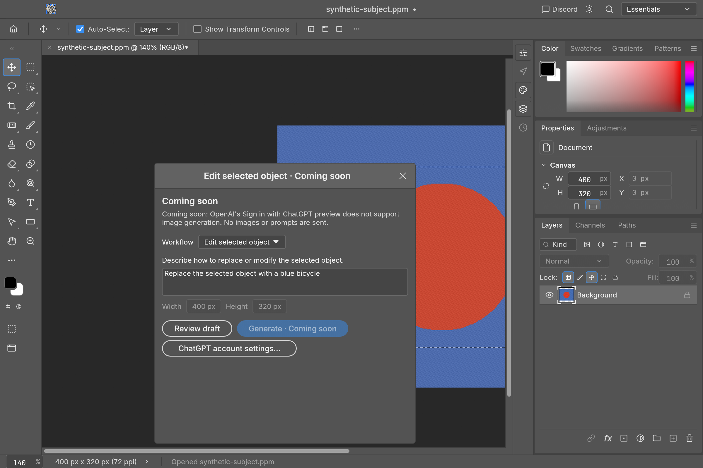
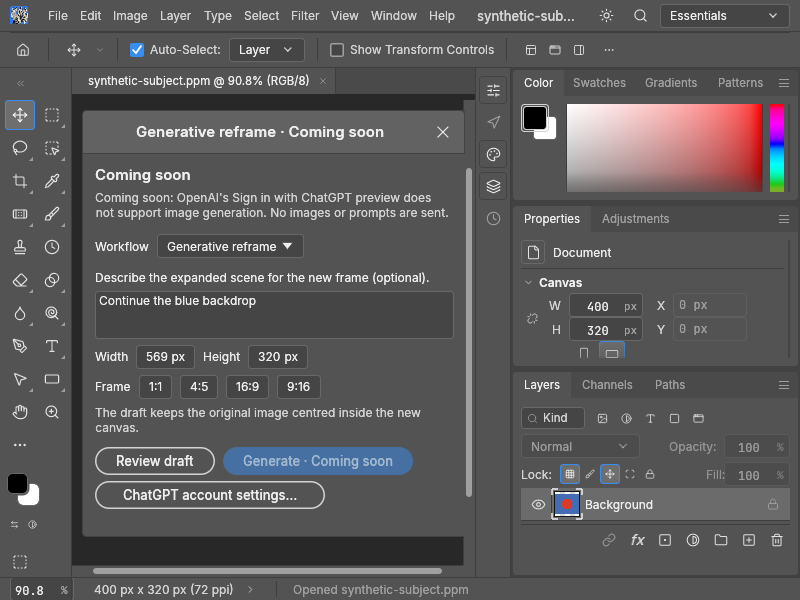

# Contextual task bar, ChatGPT account and coming-soon forms: validation

Recorded 2026-10-09 on macOS / Apple M3 Max, Rust 1.98.0. This follow-up depends on
the optional local-model contribution (#1199). Generative operations remain
disabled, including for connected accounts. This is account integration and
local draft UX, with no image-generation quality or Photoshop AI parity claim.

## Local automated checks

The full native engine, UI, automation, CLI, ML and ChatGPT suites pass with
optional native authentication and CPU model features enabled. Engine unit tests
report 848 passed / 11 ignored; UI unit tests report 923 passed / 3 ignored.
Ignored opt-in tests are not included as passes. Integration tests cover the
existing editor workflows as well as the new behavior.

Relevant new regression checks cover:

- A real pointer drag on the task bar moves it without painting or creating an
  undo step. Remove Background creates one editable mask and one undo step.
  Opened raster photos and placed Smart Objects work at 8, 16 and 32-bit; the
  placed source and rendered cache are preserved.
- All four local generative drafts validate without sampling/uploading images,
  sending requests, editing documents or consuming history, even with floating
  selection content. Document changes invalidate reviewed drafts. Invalid
  prompts, canvas sizes, operation names and UI patches fail without mutation.
- A connected simulated ChatGPT account cannot enable generation. Direct
  execution and nested automation cannot bypass the coming-soon gate or begin
  private account operations.
- Native OAuth tests use ephemeral signing keys, real loopback HTTP callbacks
  and simulated browser/token transport. They exercise registration, PKCE,
  verified returning accounts, identity/signature/nonce/time rejection,
  cancellation, rotating-token persistence, private storage and sign-out.
  They do not use a real account or consume plan usage.

Clippy passes with warnings denied across seven packages, including the native
app with `local-ml,chatgpt,heif`. Formatting, dependency layers, generated parity
(627/627), generated scorecard and the ignored adversarial `panic_hunt` check
pass. The full L0–L6 wasm check and the additional optional-feature engine wasm
check pass; native OAuth and ONNX Runtime stay outside the web dependency graph.

The native release build uses `local-ml,chatgpt,heif`. Live OpenAI authorization,
eligibility and production revocation have not been exercised. Dedicated
Linux/Windows/macOS workflows perform simulated native-auth/CPU-runtime tests
and native compile/lint checks; their actual run conclusions must be read from
CI rather than inferred from the local checks.

## Visual checks

Offscreen form layouts were inspected at 1200×800 and 800×600. The task bar is
hidden while a prompt form is open, the form scrolls when necessary, and its
title bar provides dragging. The task bar was also inspected across the five
themes, with a placed image, resized viewport, and its hidden/restored state.

Native and offscreen screenshots below use original synthetic artwork, never a personal
photograph. The baseline is the earlier contributor build `6e2b7bc`; upstream
layout changes between that build and this one are not attributed to this
feature. Screenshots of prompts show draft forms, not generated results.

Before:

After:

Optional account settings:

Four coming-soon workflows:

Smaller window:

See [generative-editing.md](generative-editing.md) for draft behavior and the
provider/apply work required before generation can be enabled, and
[chatgpt-sign-in.md](chatgpt-sign-in.md) for authentication and build details.
